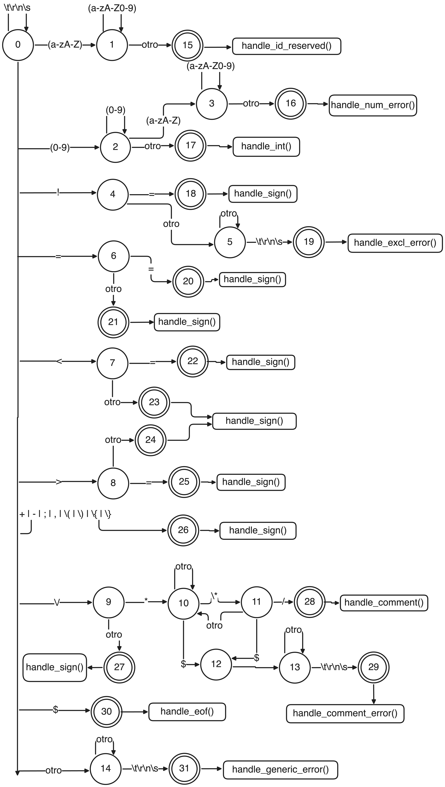

# Expresiones Regulares de Tokens para C-

Este documento corresponde al lexer implementado en [lexer.py](/Users/marcosdayanmann/src/tec/semestre_8_local/compilers-class/c_minus_compiler/c_minus_lexer/lexer.py) y [globalTypes.py](/Users/marcosdayanmann/src/tec/semestre_8_local/compilers-class/c_minus_compiler/c_minus_lexer/globalTypes.py).

## Convenciones

- `LETRA = [A-Za-z]`
- `DIGITO = [0-9]`
- `ALNUM = [A-Za-z0-9]`
- `BLANCO = [ \t\r\n]`

## Tokens reconocidos

| Token | Expresión regular | Notas |
|---|---|---|
| `IF` | `if` | Se reconoce como palabra reservada después de escanear un identificador completo. |
| `ELSE` | `else` | Igual que arriba. |
| `INT` | `int` | Igual que arriba. |
| `RETURN` | `return` | Igual que arriba. |
| `VOID` | `void` | Igual que arriba. |
| `WHILE` | `while` | Igual que arriba. |
| `ID` | `[A-Za-z][A-Za-z0-9]*` | Si el lexema coincide exactamente con una reservada, el token final no es `ID` sino la reservada correspondiente. |
| `NUM` | `[0-9]+` | Solo enteros no signados. |
| `PLUS` | `\+` |  |
| `MINUS` | `-` |  |
| `TIMES` | `\*` |  |
| `OVER` | `/` | Solo cuando `/` no inicia un comentario `/* ... */`. |
| `LT` | `<` | Solo cuando no va seguido de `=`. |
| `LTE` | `<=` |  |
| `GT` | `>` | Solo cuando no va seguido de `=`. |
| `GTE` | `>=` |  |
| `EQ` | `==` |  |
| `NEQ` | `!=` |  |
| `ASSIGN` | `=` | Solo cuando no va seguido de `=`. |
| `SEMI` | `;` |  |
| `COMMA` | `,` |  |
| `LPAREN` | `\(` |  |
| `RPAREN` | `\)` |  |
| `LBRACKET` | `\[` |  |
| `RBRACKET` | `\]` |  |
| `LBRACE` | `\{` |  |
| `RBRACE` | `\}` |  |
| `ENDFILE` | `\$` | Este `$` no pertenece al lenguaje C-. Se agrega artificialmente al final del programa para la prueba. |

## Patrones ignorados por el lexer

Estos patrones no generan token de salida:

| Tipo | Expresión regular | Notas |
|---|---|---|
| Espacios en blanco | `[ \t\r\n]+` | El DFA permanece en el estado inicial. |
| Comentario bloque | `/\*([^*]|\*+[^*/])*\*+/` | Representa comentarios estilo C no anidados. En la implementación el token se descarta. |

Nota: otra forma equivalente y más legible para el comentario es describirlo como "empieza con `/*`, termina con `*/`, y puede contener cualquier carácter entre ambos mientras no cierre el comentario antes de tiempo".

## Errores léxicos que maneja tu DFA

Aunque no son tokens válidos del lenguaje, tu implementación sí contempla estas clases de error:

| Error | Expresión regular aproximada | Cómo lo reporta el lexer |
|---|---|---|
| Entero mal formado | `[0-9]+[A-Za-z][A-Za-z0-9]*` | Devuelve `ERROR` y marca la columna donde el número deja de ser válido. |
| `!` inválido | `!([^=].*)?` | Solo `!=` es válido; cualquier otro uso de `!` produce `ERROR`. |
| Comentario sin cerrar | `/\*([^*]|\*+[^*/])*$` | Devuelve `ERROR` al llegar a EOF sin `*/`. |
| Símbolo inesperado | `[^A-Za-z0-9 \t\r\n!<>=+\\-*/;,()\\[\\]{}$][^ \t\r\n$]*` | Empieza con un carácter fuera del alfabeto del lenguaje y el lexer consume hasta encontrar espacio en blanco o EOF. |

## Observaciones importantes sobre prioridad

Para que estas expresiones produzcan los mismos tokens que tu DFA, se asumen estas reglas de prioridad:

1. Primero se aplica el criterio de lexema más largo.
2. Si un lexema coincide con `ID` y también con una palabra reservada, gana la palabra reservada.
3. `<=`, `>=`, `==` y `!=` tienen prioridad sobre `<`, `>`, `=` y `!`.
4. `/* ... */` tiene prioridad sobre `OVER`.

## DFA implementado

El DFA de tu lexer ya está en el archivo [c_minus_lexer_dfa.png](/Users/marcosdayanmann/src/tec/semestre_8_local/compilers-class/c_minus_compiler/c_minus_lexer/c_minus_lexer_dfa.png).

## Veredicto sobre la tarea

Con base en el PDF del proyecto y en tu carpeta actual, lo esencial ya está:

- Ya tienes `lexer.py`.
- Ya tienes `globalTypes.py`.
- Ya tienes un `sample.c-`.
- Ya tienes un DFA dibujado.
- Ya tienes pruebas en [test_lexer.py](/Users/marcosdayanmann/src/tec/semestre_8_local/compilers-class/c_minus_compiler/c_minus_lexer/tests/test_lexer.py).

Lo que sí faltaba era un documento explícito con las expresiones regulares. Este archivo cubre esa parte.

## Posibles detalles a revisar antes de entregar

- El PDF pide que `lexer.py` importe con `from globalTypes import *`. Tu archivo funciona, pero actualmente usa importación explícita de nombres. Si tu profesor revisa literal esa parte, conviene ajustarlo.
- Si te piden "un documento" único, este Markdown ya incluye tanto regex como referencia al DFA. Si prefieren PDF o Word, solo habría que exportarlo.
- Asegúrate de entregar también la imagen del DFA junto con este documento.
